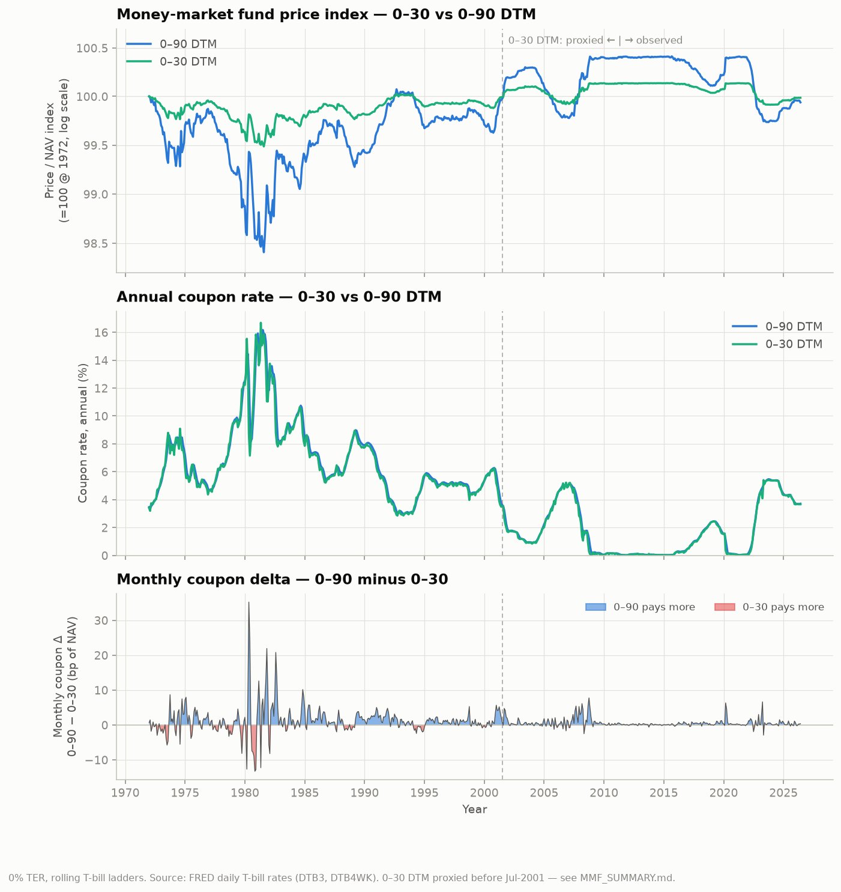
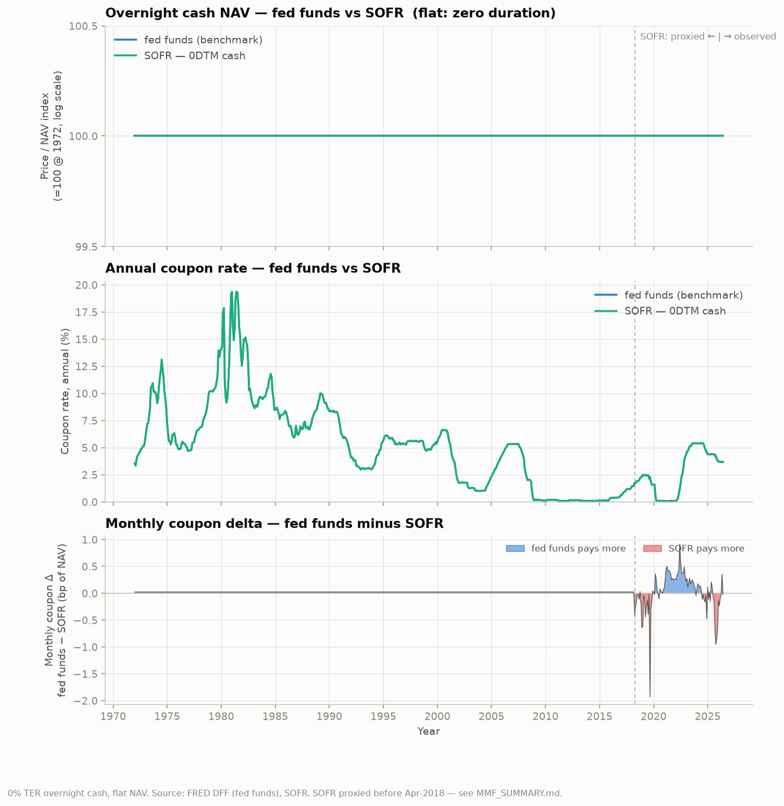

# MM-backtest

Synthetic monthly **total-return and price series for 0% TER money-market funds**
holding short-dated U.S. Treasuries / cash. The build window starts at
`start_month` in [`build_range.json`](build_range.json) (**Dec 1969**, the base row
where both indices are 100; returns start Jan 1970) and ends at
the **last complete calendar month before the build date** (a build run on
2026-10-03 ends at Sep 2026). Built from public Federal Reserve (FRED) daily
rates — no paid data feed required.

## The series

Canonical latest files live at the repo root; all are monthly, share one date
grid, and align row-for-row:

| File | Fund | Rate | Avg life |
|---|---|---|---|
| [`mmf_0_90dtm.csv`](mmf_0_90dtm.csv) | 0–90 DTM T-bills | 13-week bills | ~45 days |
| [`mmf_0_30dtm.csv`](mmf_0_30dtm.csv) | 0–30 DTM T-bills | 4-week bills | ~15 days |
| [`mmf_0dtm.csv`](mmf_0dtm.csv) | **Overnight cash (canonical, holdable)** — secured Treasury repo | SOFR (2018+; proxied before) | 0 (flat NAV) |
| [`mmf_0dtm_fed_funds.csv`](mmf_0dtm_fed_funds.csv) | Overnight fed funds — *benchmark only* | effective fed funds | 0 (flat NAV) |

For "cash," hold **`mmf_0dtm`** (SOFR) — it's what a government money-market fund
earns. `mmf_0dtm_fed_funds` is the unsecured interbank rate, a benchmark you can't
directly hold. Both are flat-NAV and yield slightly *above* the bills (the T-bill
safety premium).

Columns: `yyyymm`, `price_idx` (distributing NAV, =100 @ the build-window start),
`coupon_rate_monthly`, `coupon_rate_annual` (=`coupon_rate_monthly × 12`), `tr_idx`
(accumulating, also =100 @ the build-window start). Both indices are based at
`start_month` from [`build_range.json`](build_range.json); `price_idx` and `tr_idx`
are two share classes of the same portfolio (`tr_return = price_return + coupon`).

> [!WARNING]
> The **0–30 fund through July 2001 is proxied** — 4-week bills didn't exist then.
> Its level and long-run return are reliable, but its month-to-month difference
> from the 0–90 fund through 2001-07 is a modeling artifact, not observed data. Don't
> build 0–30-vs-0–90 spread/relative-value signals on that window. See
> [`MMF_SUMMARY.md`](MMF_SUMMARY.md).

## Charts

Two 3-pane comparisons (price/NAV semilog · annual coupon · monthly coupon delta),
shared time axis:

**Bill funds — 0–30 vs 0–90 DTM** — [`mmf_30-90DTM_compare.png`](mmf_30-90DTM_compare.png)



**Overnight cash — fed funds vs SOFR** — [`mmf_0dtm_compare.png`](mmf_0dtm_compare.png)



Bill panes: the 0–90 NAV swings ~3× wider (more duration); coupons near-identical
(flat front curve); dashed line = Aug-2001 (0–30 proxied through Jul-2001). Cash panes: NAV
flat at 100 (zero duration); the delta surfaces the Sept-2019 repo spike; dashed
line = Apr-2018 (SOFR proxied before).

## Documentation

- [`MMF_SUMMARY.md`](MMF_SUMMARY.md) — consumer summary: **what** the files are and the 0–30 caution.
- [`docs/mmf_methodology.md`](docs/mmf_methodology.md) — full **how**: model, data, validations.

## Regenerate

One command refreshes everything through the last complete month before today:

```bash
scripts/rebuild.sh                      # fetch → build → plot; or /rebuild in Claude Code
```

It runs the three stages below in order and stops at the first one that fails (e.g.
FRED hasn't yet posted the end month), so a failed stage never feeds the next. The
`/rebuild` slash command ([`.claude/commands/rebuild.md`](.claude/commands/rebuild.md))
runs the same script and summarizes what changed; it doesn't edit docs or commit.
The stages individually:

```bash
python3 scripts/fetch_fred.py           # refresh FRED inputs in data/ (pure Python, no deps)
python3 scripts/build_mmf.py            # series CSVs (pure Python, no deps)
.venv/bin/python3 scripts/plot_mmf.py   # comparison charts (needs matplotlib)
```

The fetcher downloads the full history of `DTB3`, `DTB4WK`, `DFF` and `SOFR`.
It writes nothing unless every download has the expected header and at least as
many rows as the current file, so an error page or cut-off download can't replace
good data. It prints each series' new last date and rows added; any FRED revisions
to past values show up in `git diff data/`.

The series builder writes the canonical CSVs to the repo root plus a
**timestamped** snapshot `output/<YYYYMMDD_HHMM>_mmf_<fund>.csv` (the stamp is
taken at write time). `plot_mmf.py` likewise writes the two `*_compare.png`
charts at the root and timestamped copies in `output/`. Change the start month
by editing [`build_range.json`](build_range.json) and rerunning the builder; the
end month is always the last complete month before today. If any FRED input doesn't
yet fully cover that month (not refetched, or FRED hasn't posted the month-end yet),
the builder exits with an error and writes nothing. Add a
maturity bucket by appending `{key, tenor, max_dtm}` to the `FUNDS` table in
[`scripts/build_mmf.py`](scripts/build_mmf.py).

The series builder is dependency-free Python 3; charting needs matplotlib:

```bash
python3 -m venv .venv && .venv/bin/python3 -m pip install matplotlib
```

## Repo layout

| Path | Purpose |
|---|---|
| `mmf_0_90dtm.csv`, `mmf_0_30dtm.csv`, `mmf_0dtm.csv`, `mmf_0dtm_fed_funds.csv` | Canonical latest series (repo root). |
| `mmf_30-90DTM_compare.png`, `mmf_0dtm_compare.png` | Canonical latest 3-pane comparison charts (repo root). |
| `build_range.json` | Single source of truth for the build-window start (`start_month`); the end is the last complete month before the build date. |
| `scripts/rebuild.sh`, `.claude/commands/rebuild.md` | One-shot fetch → build → plot (`/rebuild` in Claude Code). |
| `scripts/fetch_fred.py` | Refreshes the FRED inputs in `data/` (writes only if every download looks complete). |
| `scripts/build_mmf.py`, `scripts/plot_mmf.py` | Series builder and chart renderer. |
| `data/` | Raw FRED inputs (`DTB3`, `DTB4WK`, `DFF`, `SOFR`). |
| `output/` | Timestamped build-history snapshots (`YYYYMMDD_HHMM_mmf_*`). |
| `docs/`, `MMF_SUMMARY.md` | Methodology and consumer summary. |
| `PROGRESS.md` | Session handoff (printed into context at startup). |

## Development setup (Debian)

Targets **Debian 13 (trixie)**. `docker` is assumed already installed.

Install the base toolchain:

```bash
sudo apt install -y git gh python3 python3-venv python3-pip python3-dev build-essential curl jq
```

| Package | Purpose |
|---|---|
| `git` | Version control. |
| `gh` | GitHub CLI — clone, push, PRs, releases. |
| `python3` | Interpreter (the builder is pure Python 3, no third-party deps). |
| `python3-venv` | Virtual environments — required on Debian 13 (see below). |
| `python3-pip` | Installs Python dependencies (most ship as prebuilt wheels). |
| `python3-dev` | C headers for dependencies built from source. |
| `build-essential` | C/C++ compiler + make, for the same source builds. |
| `curl` | Ad-hoc HTTP fetches (`scripts/fetch_fred.py` itself uses Python's stdlib). |
| `jq` | Command-line JSON processor. |

### Installing more tools

Passwordless `sudo` is available; install extra system tooling when a task needs it:

```bash
sudo apt update                 # refresh the package index if a package isn't found
sudo apt install -y <package>   # e.g. ripgrep, sqlite3
```

Use `apt` for system-level tools; keep any Python dependencies in a project venv
rather than installing them system-wide. Record lasting dependencies in the base
toolchain list above so they stay reproducible.

### Python: Debian 13 is externally managed (PEP 668)

A system-wide `pip install` is blocked. The only Python dependency is matplotlib, for
the charts; install it in a project virtual environment:

```bash
python3 -m venv .venv && .venv/bin/python3 -m pip install matplotlib
```

(The fetcher and series builder need no packages; they run on the system `python3`.)

### Not required

- **node / npm** — not used; serve static content with `python3 -m http.server`.
- **.NET SDK** — no .NET projects.

## License

See [LICENSE](LICENSE).
